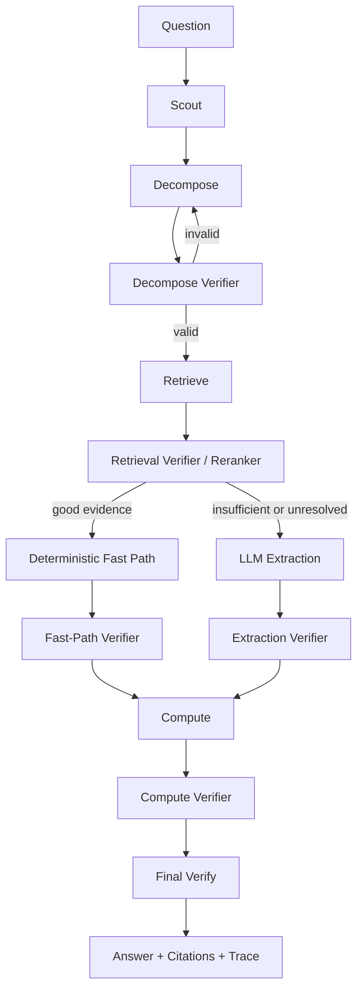

# Target Architecture

This project should converge on a single orchestrated benchmark harness, not a loose collection of scripts and not a swarm of freeform agents passing prose to each other.

The target system is:

- one orchestrator
- one canonical `QuestionState`
- one typed output per stage
- one verifier per stage, deterministic where possible
- one full trace from question to answer with citations and reproducible proof

## North Star

For every question, the system should be able to answer:

1. What did we think the question meant?
2. What evidence did we retrieve?
3. Which evidence did we trust?
4. Which values did we read from that evidence?
5. How did we compute the answer?
6. What checks did we run before accepting it?

If a stage cannot produce a justified artifact, it should fail loudly instead of pushing ambiguity downstream.

## Design Principles

- Prefer deterministic logic over LLM reasoning whenever the ledger already contains the needed structure.
- Pass structured state between stages; do not pass freeform chain-of-thought as the main interface.
- Keep retries local to the failing stage.
- Keep every stage auditable through citations, provenance, and verification output.
- Optimize stages independently, then tune integration.
- Treat OfficeQA as the proving ground before abstracting to other benchmarks.

## System Diagram



## Canonical State

Each question run should maintain one `QuestionState` object. Suggested shape:

```python
QuestionState = {
    "question": str,
    "question_id": str | None,
    "scout": {
        "hints": list[str],
        "vocabulary": dict,
    },
    "spec": dict | None,
    "spec_verification": dict | None,
    "retrieval": {
        "candidates": list[dict],
        "per_dr": dict[str, list[dict]],
        "selected": dict[str, list[dict]],
    },
    "retrieval_verification": dict | None,
    "fast_path": {
        "resolved": dict[str, dict],
        "unresolved_ids": list[str],
    },
    "fast_path_verification": dict | None,
    "extraction": dict | None,
    "extraction_verification": dict | None,
    "compute": {
        "raw_result": object,
        "formatted_answer": str | None,
    },
    "compute_verification": dict | None,
    "final_verification": dict | None,
    "failure_mode": str | None,
    "trace": list[dict],
}
```

The state should be append-only in spirit: later stages may refine fields, but they should not silently destroy upstream evidence.

## Stage Responsibilities

### 1. Scout

Purpose:
- gather cheap context before committing to a spec

Outputs:
- likely years
- row/column vocabulary menus
- likely table families

Verifier:
- deterministic only
- confirms the scout stage returned something usable or explicitly empty

### 2. Decompose

Purpose:
- convert the question into a typed `QuestionSpec`

Outputs:
- `data_requests`
- computation
- period/granularity
- output format
- vintage

Verifier:
- schema validity
- required fields
- distinct operands for binary ops
- plausible `row_hint`
- coherent year/granularity choices

### 3. Retrieve

Purpose:
- produce candidate evidence for each data request

Outputs:
- per-DR candidate tables
- retrieval scores
- retrieval channel metadata

Verifier:
- does the table actually contain the row or a close variant?
- does it contain the requested year or month?
- are units and period plausible?

### 4. Retrieval Verifier / Reranker

Purpose:
- convert a broad candidate set into a short list of trusted evidence

Outputs:
- selected evidence per DR
- explanation of why it was chosen

Verifier:
- deterministic probes first
- can down-rank tables with missing row/year intersections even if topical score is high

### 5. Deterministic Fast Path

Purpose:
- resolve values directly from the ledger when row/col structure is sufficient

Outputs:
- resolved values with exact provenance
- unresolved DR ids for fallback

Verifier:
- confirms exact row/column/year alignment
- rejects ambiguous or partial matches

### 6. LLM Extraction

Purpose:
- read only the unresolved evidence

Outputs:
- typed values
- labels
- source file / table provenance
- extraction notes

Verifier:
- compare to ledger-resolvable values where possible
- reject label-only or null-only outputs
- verify expected counts and year coverage

### 7. Compute

Purpose:
- convert extracted values into the final answer deterministically

Outputs:
- raw numeric or string result
- formatted answer

Verifier:
- complete inputs
- valid operation
- unit compatibility
- period compatibility

### 8. Final Verify

Purpose:
- catch remaining semantic mistakes

Outputs:
- `ok`
- issue
- suggested retry phase
- corrected answer if a mechanical fix is safe

Verifier:
- deterministic checks first
- LLM only where semantic review is needed

## Verifier Model

Every stage should emit:

```python
{
    "ok": bool,
    "confidence": "high" | "medium" | "low",
    "issues": list[str],
    "evidence": list[dict],
    "suggested_retry": str | None,
}
```

This makes the system a harness with proof, not just a pipeline with outputs.

## Module Layout

Target code layout:

- `orchestrator.py`
- `schemas.py`
- `state.py`
- `scout.py`
- `decompose.py`
- `spec_validate.py`
- `retrieve.py`
- `rerank.py`
- `fast_path.py`
- `extract.py`
- `compute.py`
- `verify.py`
- `metrics.py`
- `eval/`

Current large modules such as `solve.py`, `extract.py`, and `find.py` should gradually be split along these boundaries.

## What This Is Not

This should not become:

- a multi-agent prose relay
- a chain-of-thought handoff system
- multiple overlapping orchestrators
- a prompt-only workflow where deterministic checks were possible

## Decision: OfficeQA First

The system should first become excellent on OfficeQA before generalizing.

Reason:
- OfficeQA already exercises the hard parts: historical tables, year shifts, units, monthly vs annual, revisions, and footnotes.
- Premature benchmark abstraction will hide real weaknesses behind generic interfaces.
- The right order is: make the harness kill OfficeQA, then parameterize the interfaces needed for reuse.

Generalization should happen after:

1. stage contracts are stable
2. retrieval/extraction traces are auditable
3. the ingestion guarantees are explicit
4. the evaluation harness is reproducible
